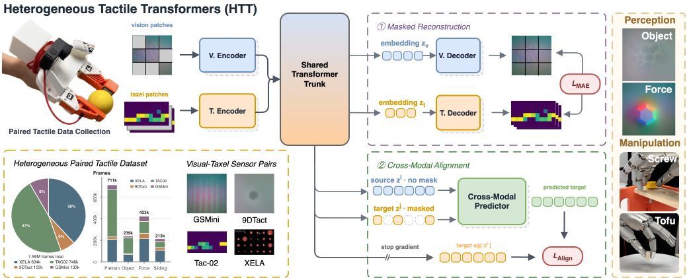

<p align="center">
  <h1 align="center">HTT: Heterogeneous Tactile Transformer</h1>
</p>

[](https://arxiv.org/abs/2606.29948)
[](https://jxbi1010.github.io/htt-gh-page/)
[](https://huggingface.co/datasets/AllenBi21/HTT-dataset)
[](https://jxbi1010.github.io/htt-gh-page/)
[](LICENSE)

This is the official code repo of the paper:

<p align="center">&nbsp;<table><tr><td>
    <p align="center">
    <strong>
        <a href="https://arxiv.org/abs/2606.29948">
            Heterogeneous Tactile Transformer
        </a><br/>
    </strong>
    Jianxin&nbsp;Bi<sup>1†</sup>, Qiang&nbsp;Wang<sup>1</sup>, Jayaram&nbsp;Reddy<sup>1</sup>, Kelvin&nbsp;Lin<sup>1</sup>,
    Soibkhon&nbsp;Khajikhanov<sup>1</sup>, Ruihan&nbsp;Gao<sup>2</sup>, Harold&nbsp;Soh<sup>1,3†</sup><br>
    <sup>1</sup><em>National University of Singapore</em> ·
    <sup>2</sup><em>Carnegie Mellon University</em> ·
    <sup>3</sup><em>Smart Systems Institute, NUS</em>
</td></tr></table>&nbsp;

# 🧾 Introduction

Tactile sensors are heterogeneous: a model trained on one sensor cannot be
directly used on another. **HTT** learns shared tactile representations across
heterogeneous sensors — sensor-specific encoders feed one shared transformer
trunk, pretrained with per-modality masked reconstruction and cross-modal
alignment on our **Heterogeneous Paired Tactile (HPT)** dataset of ~1.59M
synchronized paired frames. Drop in a raw reading from any supported sensor,
get a `[B, 192]` embedding for any downstream head.

<div align="center">
  
</div>

| Modality | Type | Raw input |
|---|---|---|
| `gsmini` | vision (GelSight Mini) | uint8 image `[224, 224, 3]` |
| `9dtact` | vision (9DTact) | uint8 image `[224, 224, 3]` |
| `xela`   | taxel array (Xela uSkin) | float `[T, 72]` |
| `tac02`  | taxel array (TAC-02) | float `[T, 66]` |

# 💻 Installation

```bash
# Python 3.10 / 3.11, PyTorch 2.x
python -m venv .venv && source .venv/bin/activate     # or conda
pip install -r requirements.txt

# checkpoint (~69 MB) — lands at checkpoints/htt_4sensors_best.pth
hf download AllenBi21/HTT-dataset htt_4sensors_best.pth --repo-type dataset --local-dir checkpoints
```

Model and dataset live in a single Hub repo:
[AllenBi21/HTT-dataset](https://huggingface.co/datasets/AllenBi21/HTT-dataset).

# 🚀 Quickstart

```python
import numpy as np
from htt import HTT

tf = HTT(modality="gsmini")                                        # loads once
frame = np.random.randint(0, 256, (224, 224, 3), dtype=np.uint8)   # your sensor frame
emb = tf(frame)                                                    # -> [1, 192]
```

Runnable demos (bundled real sensor recordings, no data setup) — see
**[examples/](examples/README.md)**:

```bash
python examples/quickstart.py
python examples/extract_features.py --modality gsmini
python examples/predict_force.py    --modality gsmini
```

# 📦 Dataset

The **HPT dataset** (1.59M frames, 4.3 GB) is on the Hub:
[AllenBi21/HTT-dataset](https://huggingface.co/datasets/AllenBi21/HTT-dataset)
— label-free paired pretraining episodes, 20-object classification, 6D-force
(static) and slip-detection (sliding) splits.

```bash
hf download AllenBi21/HTT-dataset --repo-type dataset --local-dir HTT-dataset
```

Loader docs: **[data/](data/README.md)**.

# 🏋️ Training

Reproduce the released checkpoint (joint MAE + cross-modal alignment), run
the downstream tasks, or finetune onto your own sensor — see
**[train/](train/README.md)**:

```bash
python train/run_pretrain_joint.py \
  --pretrain_config config/model/pretrain.yaml \
  --ssl_config     config/algo/pretrain_joint.yaml
```

External SITR / T3 baselines through the same probe pipeline:
**[baselines/](baselines/README.md)**.

# 📚 Documentation

- [docs/ARCHITECTURE.md](docs/ARCHITECTURE.md) — the 4-encoder + shared-trunk design
- [docs/PREPROCESSING.md](docs/PREPROCESSING.md) — raw-input contract per sensor (**read before feeding your own data**)
- [docs/TRAINING.md](docs/TRAINING.md) — full training pipeline + own-sensor finetuning

```
htt.py          # inference library: HTT / load_model / encode
train/          # pretraining, downstream tasks, SPL, finetuning   -> train/README.md
baselines/      # SITR / T3 external baselines                     -> baselines/README.md
examples/       # runnable demos on bundled real samples           -> examples/README.md
data/           # dataloaders for the released dataset             -> data/README.md
model/ utils/   # architecture + training utilities
config/         # model / algo / sensor / data configs
docs/           # architecture, preprocessing, training guides
```

# 📄 Citation

```bibtex
@article{bi2026htt,
  title   = {Heterogeneous Tactile Transformer},
  author  = {Bi, Jianxin and Wang, Qiang and Reddy, Jayaram and Lin, Kelvin and
             Khajikhanov, Soibkhon and Gao, Ruihan and Soh, Harold},
  journal = {arXiv preprint arXiv:2606.29948},
  year    = {2026}
}
```

# License

Released under **CC BY-NC 4.0** (non-commercial). Portions are derived from
Meta's V-JEPA / DINOv2 (Apache-2.0 and CC-BY-NC-4.0). See [LICENSE](LICENSE)
and [NOTICE](NOTICE) for the full terms and attributions.
